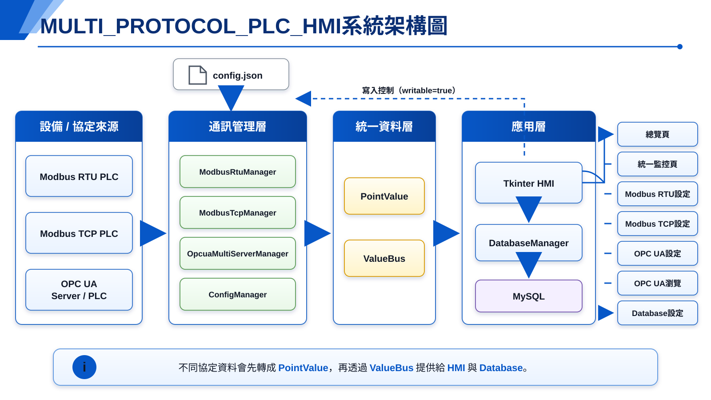
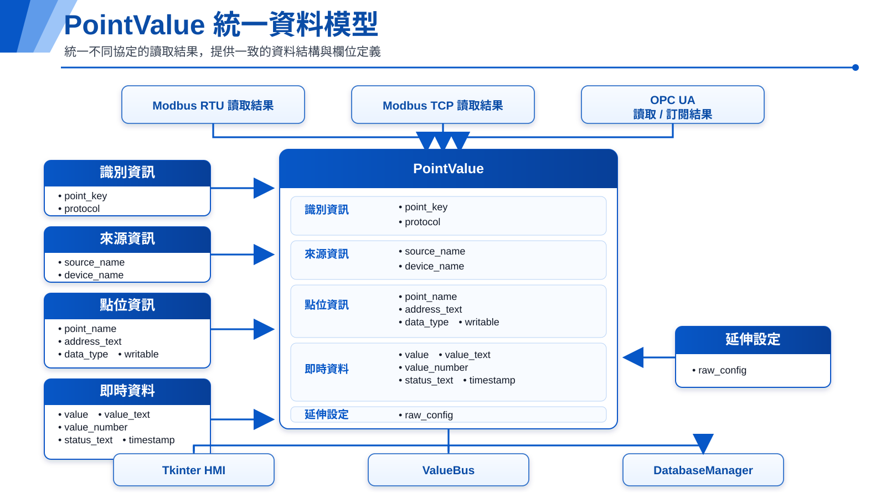

# MULTI_PROTOCOL_PLC_HMI

以Python與Tkinter開發的多協定PLC通訊整合HMI與資料採集閘道器。

本專案將Modbus RTU、Modbus TCP與OPC UA等不同協定讀取到的PLC資料，轉換成統一的資料格式，再集中顯示於同一個HMI監控介面，並可依設定寫入MySQL或MariaDB資料庫。

---

## 1.專案簡介

工業現場常同時存在不同廠牌、不同通訊協定的PLC與設備。如果每一種協定都使用獨立軟體監控，容易造成操作分散、資料格式不一致及後續整合困難。

`MULTI_PROTOCOL_PLC_HMI`的主要目標是建立一個共用的通訊與資料整合層：

- 使用不同Manager連接各種PLC協定。
- 將各協定資料轉換成統一的`PointValue`格式。
- 透過`ValueBus`將即時資料提供給HMI與DatabaseManager。
- 在同一個畫面顯示不同PLC、不同協定的點位。
- 允許對設定為可寫入的點位執行控制或參數寫入。
- 將需要保存的點位資料寫入MySQL或MariaDB。

目前專案定位為：

- 多協定PLC通訊整合HMI
- PLC資料採集閘道器
- PLC即時資料與資料庫之間的整合平台
- 後續擴充其他工業通訊協定的基礎架構

---

## 2.主要功能

### 通訊協定

- Modbus RTU
- Modbus TCP
- OPC UA

### HMI功能

- 通訊與資料庫狀態總覽
- 不同協定點位的統一監控
- 可寫入點位的數值寫入
- Modbus RTU設備與點位設定
- Modbus TCP多設備與點位設定
- OPC UA多Server連線設定
- OPC UA節點瀏覽與掃描
- MySQL/MariaDB連線與資料表管理
- 通訊、讀取、寫入與錯誤紀錄

### 資料處理

- 不同協定資料轉換成統一`PointValue`
- 透過`ValueBus`發布即時資料
- 可依點位設定決定是否允許寫入
- 可依點位設定決定是否寫入資料庫
- 支援歷史資料與最新資料分開保存
- 可設定只在數值變化時寫入歷史資料

---

## 3.系統架構

<p align="center">
  
</p>

### 架構核心

不同通訊協定不直接控制HMI畫面，而是先經過各自的Manager讀取資料，再轉換成統一的`PointValue`。

```text
Modbus RTU Manager ─┐
Modbus TCP Manager ─┼─> PointValue ─> ValueBus ─> HMI
OPC UA Manager ─────┘                         └─> DatabaseManager ─> MySQL
```

這個設計讓HMI與資料庫不需要了解每一種協定的底層細節，只要處理統一資料格式即可。

---

## 4.系統運作流程

### 程式啟動流程

1.執行`main.py`。
2.建立Tkinter主視窗。
3.讀取`config.json`。
4.建立`ConfigManager`與`ValueBus`。
5.建立Modbus RTU、Modbus TCP、OPC UA與DatabaseManager。
6.建立各個HMI頁面，並透過`app_context`共用Manager。
7.由使用者啟動需要的通訊與資料庫功能。

### PLC資料讀取流程

1.通訊Manager依照`config.json`載入設備與點位。
2.Modbus Manager依設定週期輪詢PLC。
3.OPC UA Manager透過讀取或訂閱取得Node資料。
4.讀取結果轉換成`PointValue`。
5.`PointValue`發布到`ValueBus`。
6.統一監控頁接收資料並更新畫面。
7.DatabaseManager依`db_enable`設定決定是否寫入資料庫。

### 點位寫入流程

1.使用者在統一監控頁選擇點位。
2.系統確認該點位的`writable`是否為`true`。
3.使用者確認寫入值。
4.系統依`protocol`將寫入要求交給對應Manager。
5.Manager執行Modbus或OPC UA寫入。
6.系統等待實際寫入結果後顯示成功或失敗。
7.後續輪詢或訂閱會再次讀回PLC最新狀態。

### 執行緒與非同步處理

Tkinter畫面必須由主執行緒操作，因此通訊及資料庫工作不直接阻塞UI：

- Tkinter主執行緒負責畫面與使用者操作。
- Modbus RTU與Modbus TCP使用背景輪詢執行緒。
- OPC UA使用背景執行緒與`asyncio`事件迴圈。
- DatabaseManager使用背景工作處理資料寫入。
- 程式關閉時會依序停止輪詢、OPC UA服務及資料庫工作。

---

## 5.專案目錄與模組功能

```text
MULTI_PROTOCOL_PLC_HMI/
├─ main.py
├─ config.json
├─ requirements.txt
├─ README.md
├─ README_RUN.md
├─ docs/
│  └─ images/
│     ├─ system_architecture.svg
│     └─ pointvalue_model.svg
├─ core/
│  ├─ __init__.py
│  ├─ config_manager.py
│  ├─ data_model.py
│  ├─ value_bus.py
│  ├─ database_manager.py
│  ├─ modbus_manager.py
│  ├─ modbus_tcp_manager.py
│  └─ opcua_manager.py
├─ ui/
│  ├─ __init__.py
│  ├─ app.py
│  ├─ overview_page.py
│  ├─ monitor_page.py
│  ├─ modbus_page.py
│  ├─ modbus_tcp_page.py
│  ├─ opcua_server_page.py
│  ├─ opcua_browse_page.py
│  └─ database_page.py
└─ sql/
   └─ create_tables.sql
```

### 根目錄

| 檔案 | 功能 |
|---|---|
| `main.py` | 專案入口，建立並啟動Tkinter應用程式。 |
| `config.json` | 集中保存資料庫、Modbus RTU、Modbus TCP、OPC UA設備與點位設定。 |
| `requirements.txt` | Python套件與版本需求。 |
| `README_RUN.md` | 執行環境、安裝與常見問題的補充說明。 |

### `core`核心模組

| 檔案 | 功能 |
|---|---|
| `core/config_manager.py` | 負責讀取、合併、更新及安全儲存`config.json`。 |
| `core/data_model.py` | 定義統一的`PointValue`資料模型、資料型別轉換及點位唯一鍵。 |
| `core/value_bus.py` | 即時資料交換中心，接收各協定Manager發布的資料，並提供給HMI與DatabaseManager。 |
| `core/modbus_manager.py` | Modbus RTU通訊管理，負責序列埠連線、輪詢、讀取與寫入。 |
| `core/modbus_tcp_manager.py` | Modbus TCP通訊管理，負責多台設備連線、輪詢、讀取與寫入。 |
| `core/opcua_manager.py` | OPC UA通訊管理，負責Server連線、Node讀寫、訂閱、瀏覽與掃描。 |
| `core/database_manager.py` | MySQL/MariaDB連線、資料庫與資料表建立、歷史資料及最新資料寫入。 |

### `ui`介面模組

| 檔案 | 功能 |
|---|---|
| `ui/app.py` | Tkinter主視窗、頁面建立、共用Manager注入、紀錄處理與安全關閉。 |
| `ui/overview_page.py` | 顯示Modbus RTU、Modbus TCP、OPC UA與Database目前狀態，提供快速操作。 |
| `ui/monitor_page.py` | 統一顯示所有協定點位，並提供可寫入點位的讀寫操作。 |
| `ui/modbus_page.py` | Modbus RTU連線、設備及點位設定頁。 |
| `ui/modbus_tcp_page.py` | Modbus TCP多設備、IP、Port、Unit ID及點位設定頁。 |
| `ui/opcua_server_page.py` | OPC UA Server、Endpoint、驗證資訊與監控Node設定頁。 |
| `ui/opcua_browse_page.py` | OPC UA Node瀏覽、掃描、讀取及加入監控點位。 |
| `ui/database_page.py` | MySQL/MariaDB設定、測試連線、建立資料庫與資料表。 |

### `sql`資料庫模組

| 檔案 | 功能 |
|---|---|
| `sql/create_tables.sql` | 建立`plc_point_history`與`plc_point_latest`資料表。 |

---

## 6.統一資料模型PointValue

所有協定讀到的資料都會轉換成`PointValue`，讓UI與DatabaseManager使用相同欄位處理資料。

<p align="center">
  
</p>

| 欄位 | 說明 |
|---|---|
| `point_key` | 點位唯一識別鍵。 |
| `protocol` | 通訊協定，例如`MODBUS_RTU`、`MODBUS_TCP`、`OPCUA`。 |
| `source_name` | 資料來源，例如Modbus TCP的IP與Port或OPC UA Server名稱。 |
| `device_name` | 設備名稱。 |
| `point_name` | 使用者設定的點位顯示名稱。 |
| `address_text` | Modbus資料區與位址，或OPC UA NodeId。 |
| `value` | 原始Python數值。 |
| `value_text` | 提供UI與資料庫顯示的文字值。 |
| `value_number` | 可轉換為數值時使用的數字欄位。 |
| `status_text` | 最近一次讀取或寫入狀態。 |
| `timestamp` | 資料更新時間。 |
| `writable` | 是否允許由HMI寫入。 |
| `data_type` | 資料型別，例如Bool、UInt16、Float或String。 |
| `raw_config` | 該點位的原始設定內容。 |

---

## 7.支援協定

### 7.1 Modbus RTU

Modbus RTU透過RS-485或其他序列埠介面通訊。

主要設定：

- `port`：Windows序列埠，例如`COM3`。
- `baudrate`：通訊鮑率。
- `bytesize`：資料位元。
- `parity`：同位元設定。
- `stopbits`：停止位元。
- `timeout`：讀寫逾時。
- `poll_interval`：輪詢間隔。
- `station_id`：PLC或設備站號。

支援點位類型：

- `holding_register`
- `input_register`
- `coil`
- `discrete_input`

### 7.2 Modbus TCP

Modbus TCP透過Ethernet連接PLC或Modbus TCP Gateway。

每台設備可分別設定：

- `name`
- `host`
- `port`
- `unit_id`或站號
- `timeout`
- `points`

支援同時建立多台不同IP、Port及Unit ID的設備。

Modbus設定中的`address`使用程式實際傳送的PDU位址，通常從0開始。若設備手冊使用40001、30001等顯示位址，需要依設備手冊確認換算方式。

### 7.3 OPC UA

OPC UA使用NodeId識別資料，而不是使用固定的D暫存器或M點位位址。

每台Server可設定：

- Server名稱
- `endpoint_url`
- 連線逾時
- 使用者名稱與密碼
- 訂閱更新間隔
- 需要監控的Node清單

支援功能：

- 連線與中斷Server
- 單一Node讀取
- Node寫入
- 資料變化訂閱
- Node瀏覽
- 從指定Node開始掃描
- 將掃描到的Node加入監控設定

常用標準Node：

- `i=84`：Root資料夾
- `i=85`：Objects資料夾，PLC公開的程式變數通常位於其下層

---

## 8.config.json設定

專案使用`config.json`集中管理所有通訊與資料庫設定。

主要區段：

```json
{
  "database": {},
  "modbus_rtu": {},
  "modbus_tcp": {},
  "opcua": {}
}
```

### 共用欄位

| 欄位 | 說明 |
|---|---|
| `enable` | 是否啟用該功能、設備或點位。 |
| `name` | 顯示名稱。 |
| `writable` | 是否允許使用者由HMI寫入。 |
| `db_enable` | 是否將該點位資料寫入資料庫。 |
| `data_type` | 資料型別。 |

### Modbus TCP設備範例

```json
{
  "enable": true,
  "name": "FX5U_PLC_1",
  "host": "192.168.3.250",
  "port": 502,
  "unit_id": 1,
  "timeout": 1.0,
  "points": [
    {
      "enable": true,
      "name": "目標生產數量",
      "type": "holding_register",
      "address": 1,
      "count": 1,
      "data_type": "UInt16",
      "writable": true,
      "db_enable": true
    }
  ]
}
```

### OPC UA Node範例

```json
{
  "enable": true,
  "name": "速度設定值",
  "node_id": "ns=4;s=|var|Application.PLC_PRG.rSpeedSetpoint",
  "subscribe": true,
  "writable": true,
  "data_type": "Float",
  "db_enable": true
}
```

修改設定後，可在對應頁面儲存並重新載入Manager。

---

## 9.MySQL/MariaDB資料庫設計

DatabaseManager可將啟用資料庫寫入的`PointValue`保存到兩張資料表。

### `plc_point_history`

保存點位歷史紀錄，適合用於：

- 趨勢查詢
- 生產紀錄
- 狀態變化追蹤
- 異常分析

### `plc_point_latest`

每個`point_key`只保留最新一筆資料，適合用於：

- 查詢設備目前狀態
- 建立即時Dashboard
- 提供其他系統快速查詢最新值

### 資料欄位內容

資料庫會保存下列資訊：

- 通訊協定
- 資料來源
- 設備名稱
- 點位名稱
- 位址或NodeId
- 文字值
- 數值
- 點位狀態
- 更新時間

### 資料庫建立流程

1.在Database頁輸入MySQL或MariaDB連線設定。
2.儲存設定。
3.執行測試連線。
4.若指定資料庫不存在，程式會詢問是否建立。
5.建立資料庫後，自動確認或建立必要資料表。
6.啟動自動上傳後，`db_enable=true`的點位會寫入資料庫。

可使用下列設定控制寫入行為：

- `write_history`
- `write_latest`
- `write_only_on_change`

---

## 10.安裝與啟動

### 10.1系統需求

- Windows 10或Windows 11
- Python 3.11
- Conda、Miniconda或Anaconda
- 測試Modbus RTU時需要可用的COM Port
- 測試Modbus TCP時需要可連線的PLC或Gateway
- 測試OPC UA時需要可連線的OPC UA Server
- 啟用資料庫功能時需要MySQL或MariaDB Server

### 10.2取得專案

```powershell
git clone https://github.com/PICDarcy/MULTI_PROTOCOL_PLC_HMI.git
cd MULTI_PROTOCOL_PLC_HMI
```

### 10.3建立Conda環境

```powershell
conda create -n plc_hmi python=3.11 -y
conda activate plc_hmi
```

### 10.4安裝套件

```powershell
python -m pip install --upgrade pip
python -m pip install -r requirements.txt
```

主要套件：

| 套件 | 用途 |
|---|---|
| `pymodbus` | Modbus RTU與Modbus TCP通訊。 |
| `pyserial` | Windows序列埠支援。 |
| `asyncua` | OPC UA Client、Node讀寫、訂閱與瀏覽。 |
| `pymysql` | MySQL與MariaDB連線。 |

### 10.5啟動程式

```powershell
python main.py
```

### 10.6基本檢查

```powershell
python -m py_compile main.py
python -m compileall core ui
```

更完整的安裝、資料庫建立與常見問題請參考[`README_RUN.md`](README_RUN.md)。

---

## 11.Demo測試環境

目前Demo使用兩台PLC驗證不同協定可以同時整合到同一個HMI。

### Delta AX-308E

- 通訊協定：OPC UA
- 用途：模擬一台可由OPC UA控制與監控的設備
- 測試內容：
  - 啟動命令
  - 停止命令
  - 速度設定值
  - 實際速度
  - 心跳計數
  - 設備名稱

OPC UA心跳變數會持續增加，可用來確認PLC程式與通訊仍持續運作。

### Mitsubishi FX5U

- 通訊協定：Modbus TCP
- 用途：模擬一台虛擬生產機
- 測試內容：
  - 運轉命令
  - 目前生產數量
  - 目標生產數量
  - 完成批次數
  - 批次重置命令

FX5U程式會依運轉命令增加生產數量，達到目標數量後完成批次，HMI可讀取結果並寫入控制命令。

---

## 12.基本使用流程

### 第一次使用

1.安裝Python環境與`requirements.txt`套件。
2.啟動程式。
3.依需要設定Modbus RTU、Modbus TCP或OPC UA。
4.設定需要讀取的點位或Node。
5.設定點位是否允許寫入。
6.設定點位是否寫入資料庫。
7.到Database頁設定MySQL或MariaDB。
8.測試資料庫連線並建立必要資料表。
9.回到總覽頁啟動通訊與資料庫自動上傳。
10.到統一監控/讀寫頁查看所有PLC資料。

### Modbus TCP操作

1.進入「Modbus TCP設定」。
2.新增PLC設備。
3.設定設備名稱、IP、Port與Unit ID。
4.新增需要讀取的點位。
5.設定點位類型、Address、Count與Data Type。
6.設定`writable`與`db_enable`。
7.儲存設定並啟動輪詢。
8.到統一監控頁確認資料。

### OPC UA操作

1.進入「OPC UA Server設定」。
2.新增Server並設定Endpoint。
3.依Server設定帳號密碼或匿名連線。
4.連線Server。
5.進入「OPC UA瀏覽/掃描」。
6.從`i=85`或指定Node開始瀏覽與掃描。
7.將需要的Node加入監控設定。
8.啟用訂閱或執行讀取。
9.到統一監控頁確認資料。

### 點位寫入

1.在統一監控頁選擇`writable=true`的點位。
2.輸入寫入值。
3.確認點位、位址及寫入內容。
4.執行寫入。
5.確認系統回報寫入成功。
6.等待後續輪詢或訂閱讀回PLC最新值。

---

## 授權與使用

目前專案主要用於多協定PLC通訊整合、功能驗證與Demo展示。實際設備的位址、資料型別、讀寫權限與安全控制，應依PLC型號、設備手冊及現場規範設定。
